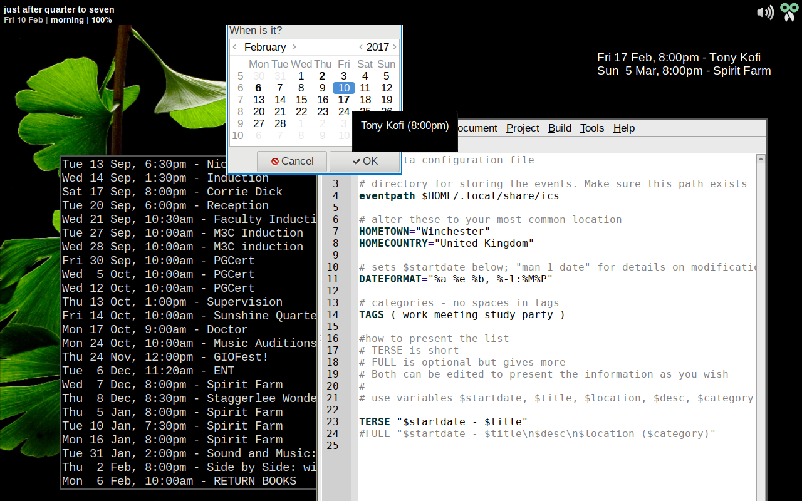

# estonta
A simple Bash and [Yad](https://sourceforge.net/projects/yad-dialog/)-based appointment system.

It has two scripts: **aldonos** (add an event, using Yad) and **lerta** (list events, in a shell).





## aldonos
aldonos produces iCalendar files in a directory (set in $HOME/.config/estonta.conf).

## lerta
lerta displays a list of events in the directory. You can filter them by category; or find an event by date. It's VERY basic.

## Installation

```
sudo install -p -D aldonos -m 0755 /usr/local/bin/aldonos
sudo install -p -D lerta -m 0755 /usr/local/bin/lerta
install -p -D estonta.conf -m 0644 $HOME/.config/estronta.conf
```

Then use your favourite text editor to edit **estronta.conf**.

## Use
First, run **lerta**.
```
$ lerta
New directory created at /home/corey/.local/share/ics.
No events found
```
Then run **aldonos** to add an event. A series of dialogs will guide you through adding an event. An iCalendar file is added to the directory.

You can then list the event with **lerta**. If you want to display an event on a certain day, use the **-d** switch: this takes a date string (in quotes) as detailed in the manpage for date(1).
```
$ lerta -d "Friday"
22 Jul '16 @ 14:00 - Picnic
Normanton Park, Derby, United Kingdom
Bring a blanket!

No alcohol on the park
```
The **-c** switch filters events by category.

## Why?
I got sick--thoroughly sick--of not having a straightforward, transparent way of making events on my laptop. By transparent I mean making an event that I can then send to something else (like a phone; or my site) without a conversion step or a binary program. I also needed something that would give me a plain list of events that I could use in Conky. 


