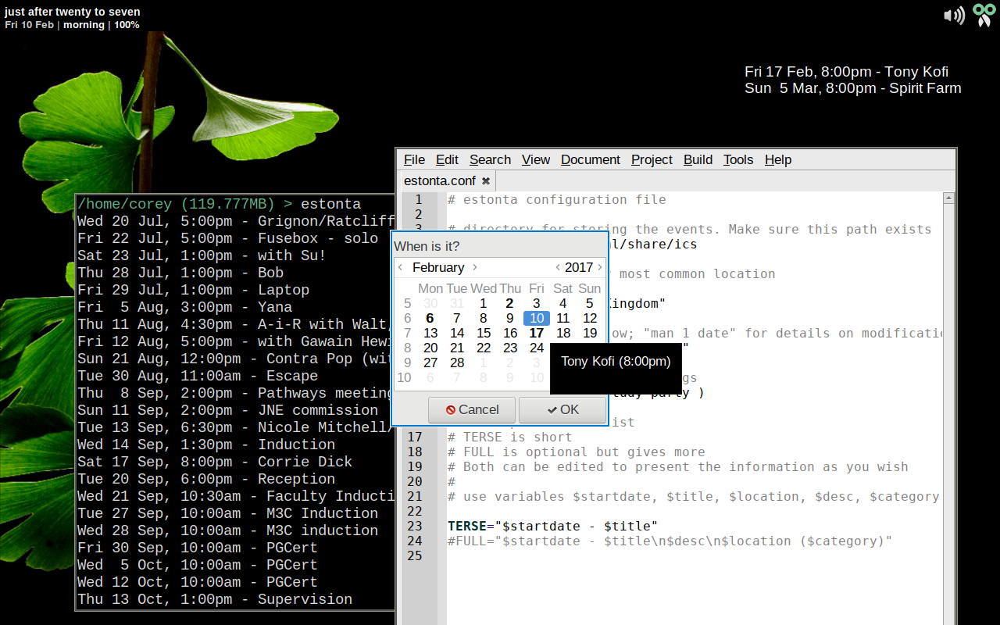
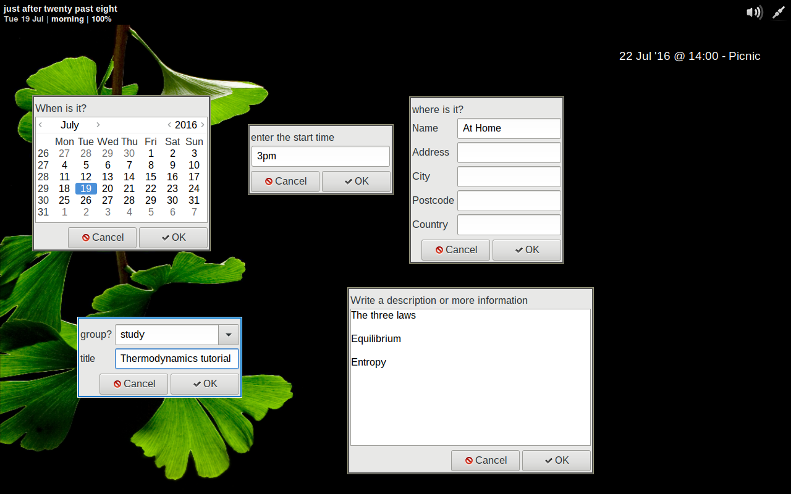

# estonta
A simple Bash-based calendar application. It also has an optional [Yad](https://sourceforge.net/projects/yad-dialog/)-based interface for entering events.





estonta creates iCalendar files in a directory (which you can set in $HOME/.config/estonta.conf). It can also display a list of those events. You can filter them by category; search event summaries by word; or find an event by date.

## Installation

If you use Arch Linux, you can install it from the AUR:

https://aur.archlinux.org/packages/estonta-git/

otherwise, 

```
sudo install -p -D estonta -m 0755 /usr/local/bin/estonta
install -p -D estonta.conf -m 0644 $HOME/.config/estonta.conf
```

Then use your favourite text editor to edit **estonta.conf**.

## Use
First, run **estonta** in a terminal.
```
$ estonta
New directory created at /home/corey/.local/share/ics.
No events found
```
Then run **estonta -a** to add an event. A series of questions (or with the **-g**, Yad dialogs) will guide you through adding an event. An iCalendar file is added to the directory.



Here's an example from a terminal
```
$ estonta -a
*What date is the event (date: use DATESTRING format - no commas!)? *
20 Jul
*Enter the start time: *
7pm
*Where is it (Press Enter to skip)? *
Out!
*Please give the event a title  (Press Enter to skip):*
Hitting the clubs
*any tags  (Press Enter to skip)?*

*Write a short description (Press Enter to skip): *
Yes!
Event saved.
```

You can then list the event with **estonta**. If you want to display an event on a certain day, use the **-d** switch: this takes a date string (in quotes) as detailed in the manpage for date(1).
```
$ estonta -d "Friday"
22 Jul '16 @ 14:00 - Picnic
Normanton Park, Derby, United Kingdom
Bring a blanket!

No alcohol on the park
```
#### A note on date strings
Date strings are handy: they're "human readable". However, they're not calculated by humans. So bear in mind...
* "next Thursday" means "Thursday coming" and NOT "Thursday, next week". For Thursday, next week use "next week Thursday"; and
* don't use commas.


The **-c** switch filters events by category.
```
estonta -c "study"
19 Jul '16 @ 15:00 - Thermodynamics tutorial
```
The **-s** switch allows you to search for events where the summary contains a certain word. It's case sensitive.
```
estonta -s M3C
Tue 27 Sep, 10:00am - M3C Induction
Wed 28 Sep, 10:00am - M3C induction
```

You can find events within a date range with **estonta -r "startdate" "enddate"**. 

```
$ estonta -r "now" "+7days"
Thu 28 Jul, 1:00pm - Bob
Fri 29 Jul, 1:00pm - Laptop
```
Here's how to look into the past:
```
$ estonta -r "-7days" "now"
Wed 20 Jul, 5:00pm - Grignon/Ratcliffe
Fri 22 Jul, 5:00pm - Fusebox - solo
```
You could alias a range on the commandline, or in ~/.bashrc:

```
$ alias next7days='estonta -r "now" "+7days"'
$ next7days 
Thu 28 Jul, 1:00pm - Bob
Fri 29 Jul, 1:00pm - Laptop
```


You can edit and delete events by editing the ics files. You can also add events from other software by exporting them into the configured directory.

### with Conky
In a Conky file, something like
```
{execi 10 estonta}
```
## Sharing
estonta produces iCalendar (.ics) files, so you can share them with any application or device that can read that file type. If you have Dropbox (or another file sync service), you can set the events directory to be created in there, making it handy for sharing events across different laptops and phones.

## Why?
I got sick of not having a straightforward, transparent way of making events on my laptop. By transparent I mean making an event that I can then send to something else (like a phone; or my site) without a conversion step or a binary program. I also needed something that would give me a plain list of events that I could use in Conky. I didn't want anything big, like a full calendaring application; just something I could look at quickly, and also add to if needed. 

The name is Esperanto.


